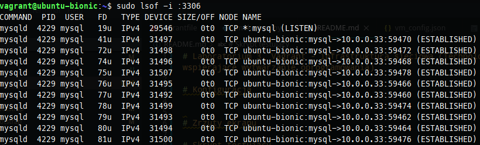
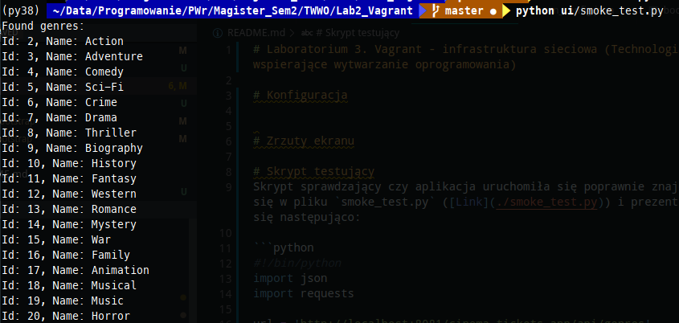

# Laboratorium 3. Vagrant - infrastruktura sieciowa (Technologie wspierające wytwarzanie oprogramowania)

## Konfiguracja

### Ogólna konfiguracja

Maszyny można konfigurować poprzez modyfikacje wartości w pliku `vm_config.json` ([Link](./vm_config.json)). Sam plik prezentuje się następująco:

```json
{
    "DB_NAME": "cinema_tickets_app_db",
    "DB_USERNAME": "test",
    "DB_PASSWORD": "test",
    "APP_IP": "10.0.0.33",
    "DB_IP": "10.0.0.34",
    "DB_PORT": 3306
}
```

Wyjaśnienia:

* *DB_NAME* - nazwa bazy danych
* *DB_USERNAME* - nazwa użytkownika w bazie danych
* *DB_PASSWORD* - hasło do bazy danych
* *DB_IP* - adres maszyny zawierającej bazę danych
* *DB_PORT* - port bazy danych
* *APP_IP* - adres maszyny zawierającej aplikacje (musi znajdować sie w tym samym subnecie co *DB_IP*)

Właściwa konfiguracja maszyn znajduje się w pliku `Vagrantfile` ([Link](./Vagrantfile)). W konfiguracji zdefiniowano dwie maszyny, które obierają się na tym samym obrazie `ubuntu/bionic64` oraz posiadają obustronną synchronizację folderów.

### Konfiguracja maszyny z bazą danych

Konfiguracja maszyny z bazą danych:

```ruby
config.vm.define "db" do |db|
  db.vm.network "private_network", ip: vm_config['DB_IP']
  
  db.vm.provision "shell",
    path: "bootstrap/database.sh",
      env: {
        "DB_NAME" => vm_config['DB_NAME'],
        "DB_USERNAME" => vm_config['DB_USERNAME'],
        "DB_PASSWORD" => vm_config['DB_PASSWORD']
      }
  end
```

W przypadku maszyny z bazą danych zdefiniowana została sieć prywatna, która pozwoli na komunikację ze strony aplikacji. W etapie `provisioning` uruchamiany jest skrypt konfigurujący, w którego wysyłane są: `nazwa bazy danych`, `nazwa użytkownika`, `hasło użytkownika`. Sam skrypt tak jak w poprzednim zadaniu tworzy bazę oraz użytkownika z pełnym dostepem.

Dodatkowo dodano dodawania i usuwanie pliku `.db_setup_completed`, który ma umożliwić synchronizację pomiędzy dwiema maszynami. Dodatkowo skrypt ustawia właściwość `bind-address` na wartość `0.0.0.0`, aby umożliwić komunikację z bazą z zewnątrz.

```bash
sudo ufw allow mysql/tcp
echo "bind-address = 0.0.0.0" | sudo tee -a /etc/mysql/my.cnf
```

### Konfiguracja maszyny z aplikacją

Konfiguracja maszyny z aplikacją:

```ruby
config.vm.define "app" do |app|
  app.vm.network "private_network", ip: vm_config['APP_IP']
  app.vm.network "forwarded_port", guest: 8081, host: 8081

  app.vm.provision "shell",
    path: "bootstrap/bootstrap.sh",
    env: {
        "DB_NAME" => vm_config['DB_NAME'],
        "DB_USERNAME" => vm_config['DB_USERNAME'],
        "DB_PASSWORD" => vm_config['DB_PASSWORD'],
        "APP_IP" => vm_config['APP_IP'],
        "DB_HOST" => vm_config['DB_IP'],
        "DB_PORT" => vm_config['DB_PORT']
    }

  app.vm.provider "virtualbox" do |vb|
    vb.memory = "4096"
    vb.cpus = "2"
  end
end
```

W przypadku maszyny z konfiguracją skonfigurowano sieć prywatną, tak aby była w tym samym subnecie co maszyna z bazą danych, w celu umożliwienia komunikacji. Dodatkowo dodano opcję `forward_port`, tak aby host mógł uzyskać dostęp do aplikacji z zewnątrz.

Dodatkowo zmodyfikowano skrypt instalujący aplikację, dodano na jego początku pętle sprawdzającą obecność pliku `.db_setup_completed`, dalsza konfiguracja nastąpi tylko po utworzeniu tego pliku przez skrypt instalujący bazę danych.

```bash
while [ ! -f /vagrant/bootstrap/.db_setup_completed ]
do
  sleep 20
  echo "Waiting for database configuration..."
done
```

## Uruchomienie maszyn

Maszyny uruchamia się za pomocą komendy:

```bash
vagrant up
```

W przypadku działających maszyn możemy je przeładować za pomocą:

```bash
vagrant reload
```

lub ponowanie uruchomić skrypty konfigurujące poprzez wywołanie

```bash
vagrant provision
```

W celu usunięcia maszyn należy uruchomic polecenie:

```bash
vagrant destroy
```

## Weryfikacja działania maszyn

### Sprawdzenie serwisów

Aby sprawdzić czy serwisy uruchomiły się poprawnie należy zalogować się do maszyn wirtualnego, a następnie wykorzystać polecenie `lsof`.

W celu zalogowania się do maszyny z bazą danych należy wykonać polecenie:

```bash
vagrant ssh db
```

Baza danych uruchamiana jest domyślnie na porcie `3306`. Efekt wywołania komendy `lsof` powinien być następujący:



W celu połaczenia się z maszyną backendu należy użyć komendy:

```bash
vagrant ssh app
```

Backend uruchamia się na porcie `8081`, aby zwalidować jego działanie należy wywołać komendę `lsof`, rezultat powinien być następujący:


### Skrypt testujący

Skrypt sprawdzający czy aplikacja uruchomiła się poprawnie znajduje się w pliku `smoke_test.py` ([Link](./smoke_test.py)) i prezentuje się następująco:

```python
#!/bin/python
import json
import requests

url = 'http://localhost:8081/cinema-tickets-app/api/genres'
response_json = requests.get(url).json()

print('Found genres:')

for genre in response_json:
    id = genre['id']
    name = genre['name']
    print(f"Id: {id}, Name: {name}")
```

Skrypt wykorzystuje jeden z nielicznych endpointów niewymagających autoryzacji do pobrania listy gatunków znajdującej się w bazie danych. Efektem działania skryptu powinna być lista gatunków zaprezentowana poniżej:

